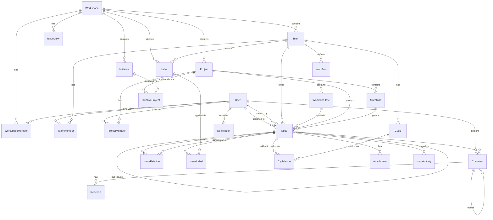

# SitRep — Data Model

> Comprehensive data model for the SitRep app — a Linear clone built with .NET 10, EF Core, and PostgreSQL.
> Intended to be used by AI agents to generate EF Core entity classes, `DbContext`, and migration configurations.

---

## Conventions

- All primary keys are `Guid` (UUID).
- All entities include `CreatedAt` and `UpdatedAt` (`DateTimeOffset`).
- Soft deletes via `DeletedAt` (`DateTimeOffset?`) on select entities.
- String identifiers (e.g. `ENG-123`) are derived/computed, not stored.
- Auth/identity is managed by Keycloak; `User` is a local mirror of the Keycloak subject.
- Foreign key properties use the pattern `{EntityName}Id`.
- Navigation collections use `ICollection<T>` and are initialized to `[]`.
- All `string` properties are non-nullable unless marked optional (`?`).

---

## Enums

```csharp
enum IssuePriority    { NoPriority = 0, Urgent = 1, High = 2, Medium = 3, Low = 4 }
enum IssueRelationType { Blocks, IsBlockedBy, Duplicate, RelatesTo }
enum WorkflowStateCategory { Backlog, Unstarted, Started, Completed, Cancelled }
enum ProjectStatus    { Planned, InProgress, Paused, Completed, Cancelled }
enum MemberRole       { Member, Admin, Owner }
enum NotificationType { IssueAssigned, IssueComment, IssueMention, IssuePriorityChanged,
                        IssueStatusChanged, CycleStarted, ProjectUpdate }
```

---

## Entities

---

### Workspace

Top-level container for all organizational data. A user may belong to multiple workspaces.

| Property        | Type              | Notes                                |
|-----------------|-------------------|--------------------------------------|
| `Id`            | `Guid`            | PK                                   |
| `Name`          | `string`          | Display name (e.g. "Acme Corp")      |
| `Slug`          | `string`          | URL-safe identifier, unique globally |
| `LogoUrl`       | `string?`         | Optional logo image URL              |
| `CreatedAt`     | `DateTimeOffset`  |                                      |
| `UpdatedAt`     | `DateTimeOffset`  |                                      |

**Navigation Properties**
- `ICollection<WorkspaceMember> Members`
- `ICollection<Team> Teams`
- `ICollection<Project> Projects`
- `ICollection<Initiative> Initiatives`
- `ICollection<Label> Labels`
- `ICollection<IssueView> IssueViews`

**Indexes:** `Slug` (unique)

---

### User

Local mirror of the Keycloak identity. Synced on first login via OIDC token claims.

| Property        | Type              | Notes                                         |
|-----------------|-------------------|-----------------------------------------------|
| `Id`            | `Guid`            | PK — matches Keycloak subject (`sub`) claim   |
| `Email`         | `string`          | Unique                                        |
| `DisplayName`   | `string`          |                                               |
| `AvatarUrl`     | `string?`         |                                               |
| `CreatedAt`     | `DateTimeOffset`  |                                               |
| `UpdatedAt`     | `DateTimeOffset`  |                                               |

**Navigation Properties**
- `ICollection<WorkspaceMember> WorkspaceMemberships`
- `ICollection<Issue> AssignedIssues`
- `ICollection<Comment> Comments`
- `ICollection<Notification> Notifications`

**Indexes:** `Email` (unique)

---

### WorkspaceMember

Join entity between `User` and `Workspace`. Stores per-workspace role.

| Property        | Type              | Notes                          |
|-----------------|-------------------|--------------------------------|
| `Id`            | `Guid`            | PK                             |
| `WorkspaceId`   | `Guid`            | FK → Workspace                 |
| `UserId`        | `Guid`            | FK → User                      |
| `Role`          | `MemberRole`      | `Member`, `Admin`, `Owner`     |
| `JoinedAt`      | `DateTimeOffset`  |                                |

**Navigation Properties**
- `Workspace Workspace`
- `User User`

**Indexes:** `(WorkspaceId, UserId)` (unique)

---

### Team

Represents a group of people or a product area within a workspace.

| Property        | Type              | Notes                                          |
|-----------------|-------------------|------------------------------------------------|
| `Id`            | `Guid`            | PK                                             |
| `WorkspaceId`   | `Guid`            | FK → Workspace                                 |
| `Name`          | `string`          |                                                |
| `Identifier`    | `string`          | Short uppercase key (e.g. "ENG"), unique per workspace |
| `Description`   | `string?`         |                                                |
| `Color`         | `string?`         | Hex color string                               |
| `IconUrl`       | `string?`         |                                                |
| `TriageEnabled` | `bool`            | Default: `false`                               |
| `CyclesEnabled` | `bool`            | Default: `false`                               |
| `IssueCounter`  | `int`             | Auto-incremented per team for identifier generation |
| `CreatedAt`     | `DateTimeOffset`  |                                                |
| `UpdatedAt`     | `DateTimeOffset`  |                                                |
| `ArchivedAt`    | `DateTimeOffset?` | Soft archive                                   |

**Navigation Properties**
- `Workspace Workspace`
- `ICollection<TeamMember> Members`
- `ICollection<Issue> Issues`
- `ICollection<Workflow> Workflows`
- `ICollection<Cycle> Cycles`
- `ICollection<Label> Labels`

**Indexes:** `(WorkspaceId, Identifier)` (unique)

---

### TeamMember

Join entity between `User` and `Team`.

| Property        | Type              | Notes                      |
|-----------------|-------------------|----------------------------|
| `Id`            | `Guid`            | PK                         |
| `TeamId`        | `Guid`            | FK → Team                  |
| `UserId`        | `Guid`            | FK → User                  |
| `Role`          | `MemberRole`      |                            |
| `JoinedAt`      | `DateTimeOffset`  |                            |

**Navigation Properties**
- `Team Team`
- `User User`

**Indexes:** `(TeamId, UserId)` (unique)

---

### Workflow

An ordered set of statuses (`WorkflowState`) scoped to a team. Each team has exactly one active workflow at a time.

| Property        | Type              | Notes                     |
|-----------------|-------------------|---------------------------|
| `Id`            | `Guid`            | PK                        |
| `TeamId`        | `Guid`            | FK → Team                 |
| `Name`          | `string`          | e.g. "Default Workflow"   |
| `CreatedAt`     | `DateTimeOffset`  |                           |
| `UpdatedAt`     | `DateTimeOffset`  |                           |

**Navigation Properties**
- `Team Team`
- `ICollection<WorkflowState> States`

---

### WorkflowState

An individual status within a workflow (e.g. "In Progress", "Done").

| Property        | Type                    | Notes                                         |
|-----------------|-------------------------|-----------------------------------------------|
| `Id`            | `Guid`                  | PK                                            |
| `WorkflowId`    | `Guid`                  | FK → Workflow                                 |
| `Name`          | `string`                | e.g. "In Review"                              |
| `Category`      | `WorkflowStateCategory` | Used for grouping/filtering                   |
| `Color`         | `string`                | Hex color                                     |
| `Position`      | `int`                   | Ordering within workflow                      |
| `IsDefault`     | `bool`                  | Applied to new issues; one default per team   |
| `Description`   | `string?`               |                                               |

**Navigation Properties**
- `Workflow Workflow`
- `ICollection<Issue> Issues`

**Indexes:** `(WorkflowId, Position)`

---

### Label

Categorization tags for issues. Can be scoped to a workspace or a specific team.

| Property        | Type              | Notes                                         |
|-----------------|-------------------|-----------------------------------------------|
| `Id`            | `Guid`            | PK                                            |
| `WorkspaceId`   | `Guid`            | FK → Workspace                                |
| `TeamId`        | `Guid?`           | FK → Team (null = workspace-wide label)       |
| `Name`          | `string`          |                                               |
| `Color`         | `string`          | Hex color                                     |
| `Description`   | `string?`         |                                               |
| `CreatedAt`     | `DateTimeOffset`  |                                               |

**Navigation Properties**
- `Workspace Workspace`
- `Team? Team`
- `ICollection<IssueLabel> IssueLabels`

---

### Issue

The core entity. Belongs to exactly one team. Has a human-readable identifier derived from team identifier + counter.

| Property          | Type              | Notes                                                         |
|-------------------|-------------------|---------------------------------------------------------------|
| `Id`              | `Guid`            | PK                                                            |
| `TeamId`          | `Guid`            | FK → Team                                                     |
| `WorkflowStateId` | `Guid`            | FK → WorkflowState                                            |
| `Title`           | `string`          | Required                                                      |
| `Description`     | `string?`         | Rich text / markdown content                                  |
| `Priority`        | `IssuePriority`   | Default: `NoPriority`                                         |
| `Estimate`        | `int?`            | Story points or time estimate                                 |
| `Number`          | `int`             | Team-scoped auto-increment (ENG-1, ENG-2, …)                  |
| `AssigneeId`      | `Guid?`           | FK → User                                                     |
| `CreatedById`     | `Guid`            | FK → User                                                     |
| `ParentIssueId`   | `Guid?`           | FK → Issue (self-referencing — sub-issues)                    |
| `ProjectId`       | `Guid?`           | FK → Project (optional)                                       |
| `MilestoneId`     | `Guid?`           | FK → Milestone (optional)                                     |
| `DueDate`         | `DateOnly?`       |                                                               |
| `SortOrder`       | `double`          | Fractional indexing for drag-and-drop ordering                |
| `CreatedAt`       | `DateTimeOffset`  |                                                               |
| `UpdatedAt`       | `DateTimeOffset`  |                                                               |
| `CompletedAt`     | `DateTimeOffset?` | Set when status category becomes `Completed` or `Cancelled`   |
| `ArchivedAt`      | `DateTimeOffset?` | Soft archive                                                  |

**Navigation Properties**
- `Team Team`
- `WorkflowState WorkflowState`
- `User? Assignee`
- `User CreatedBy`
- `Issue? ParentIssue`
- `ICollection<Issue> SubIssues`
- `Project? Project`
- `Milestone? Milestone`
- `ICollection<IssueLabel> Labels`
- `ICollection<IssueRelation> OutwardRelations`
- `ICollection<IssueRelation> InwardRelations`
- `ICollection<CycleIssue> CycleIssues`
- `ICollection<Comment> Comments`
- `ICollection<Attachment> Attachments`
- `ICollection<IssueActivity> Activities`

**Indexes:** `(TeamId, Number)` (unique), `TeamId`, `AssigneeId`, `WorkflowStateId`, `ProjectId`

---

### IssueRelation

Represents a directed relationship between two issues (e.g. blocks/is-blocked-by).

| Property         | Type                | Notes                             |
|------------------|---------------------|-----------------------------------|
| `Id`             | `Guid`              | PK                                |
| `SourceIssueId`  | `Guid`              | FK → Issue                        |
| `TargetIssueId`  | `Guid`              | FK → Issue                        |
| `Type`           | `IssueRelationType` | e.g. `Blocks`, `Duplicate`        |
| `CreatedAt`      | `DateTimeOffset`    |                                   |

**Navigation Properties**
- `Issue SourceIssue`
- `Issue TargetIssue`

**Indexes:** `(SourceIssueId, TargetIssueId, Type)` (unique)

---

### IssueLabel

Many-to-many join between `Issue` and `Label`.

| Property    | Type   | Notes          |
|-------------|--------|----------------|
| `IssueId`   | `Guid` | FK → Issue, PK |
| `LabelId`   | `Guid` | FK → Label, PK |

**Navigation Properties**
- `Issue Issue`
- `Label Label`

**Composite PK:** `(IssueId, LabelId)`

---

### Comment

A comment on an issue. Supports threaded replies via `ParentCommentId`.

| Property          | Type              | Notes                            |
|-------------------|-------------------|----------------------------------|
| `Id`              | `Guid`            | PK                               |
| `IssueId`         | `Guid`            | FK → Issue                       |
| `AuthorId`        | `Guid`            | FK → User                        |
| `ParentCommentId` | `Guid?`           | FK → Comment (threaded replies)  |
| `Body`            | `string`          | Markdown content                 |
| `EditedAt`        | `DateTimeOffset?` | Set when comment is edited       |
| `CreatedAt`       | `DateTimeOffset`  |                                  |
| `UpdatedAt`       | `DateTimeOffset`  |                                  |
| `DeletedAt`       | `DateTimeOffset?` | Soft delete                      |

**Navigation Properties**
- `Issue Issue`
- `User Author`
- `Comment? ParentComment`
- `ICollection<Comment> Replies`
- `ICollection<Reaction> Reactions`

---

### Reaction

An emoji reaction on a `Comment`.

| Property    | Type             | Notes             |
|-------------|------------------|-------------------|
| `Id`        | `Guid`           | PK                |
| `CommentId` | `Guid`           | FK → Comment      |
| `UserId`    | `Guid`           | FK → User         |
| `Emoji`     | `string`         | Unicode emoji character or shortcode |
| `CreatedAt` | `DateTimeOffset` |                   |

**Indexes:** `(CommentId, UserId, Emoji)` (unique)

---

### Attachment

A file or link attachment on an `Issue`.

| Property      | Type             | Notes                                |
|---------------|------------------|--------------------------------------|
| `Id`          | `Guid`           | PK                                   |
| `IssueId`     | `Guid`           | FK → Issue                           |
| `UploadedById`| `Guid`           | FK → User                            |
| `FileName`    | `string`         |                                      |
| `FileSize`    | `long`           | Bytes                                |
| `ContentType` | `string`         | MIME type                            |
| `StorageUrl`  | `string`         | Internal storage path or URL         |
| `CreatedAt`   | `DateTimeOffset` |                                      |

---

### IssueActivity

Audit log / activity feed entry for changes to an issue. Stored as structured JSON for flexibility.

| Property       | Type             | Notes                                                          |
|----------------|------------------|----------------------------------------------------------------|
| `Id`           | `Guid`           | PK                                                             |
| `IssueId`      | `Guid`           | FK → Issue                                                     |
| `ActorId`      | `Guid`           | FK → User                                                      |
| `Type`         | `string`         | e.g. `"status_changed"`, `"assignee_changed"`, `"comment_added"` |
| `FromValue`    | `string?`        | Previous value (serialized)                                    |
| `ToValue`      | `string?`        | New value (serialized)                                         |
| `Metadata`     | `string?`        | JSON blob for extra context                                    |
| `CreatedAt`    | `DateTimeOffset` |                                                                |

**Indexes:** `IssueId`, `ActorId`

---

### Project

Groups issues toward a time-bound deliverable. Can span multiple teams.

| Property         | Type              | Notes                             |
|------------------|-------------------|-----------------------------------|
| `Id`             | `Guid`            | PK                                |
| `WorkspaceId`    | `Guid`            | FK → Workspace                    |
| `Name`           | `string`          |                                   |
| `Description`    | `string?`         | Markdown                          |
| `Status`         | `ProjectStatus`   | Default: `Planned`                |
| `Color`          | `string?`         | Hex color                         |
| `IconUrl`        | `string?`         |                                   |
| `LeadId`         | `Guid?`           | FK → User (project lead)          |
| `StartDate`      | `DateOnly?`       |                                   |
| `TargetDate`     | `DateOnly?`       |                                   |
| `CompletedAt`    | `DateTimeOffset?` |                                   |
| `CreatedById`    | `Guid`            | FK → User                         |
| `CreatedAt`      | `DateTimeOffset`  |                                   |
| `UpdatedAt`      | `DateTimeOffset`  |                                   |
| `ArchivedAt`     | `DateTimeOffset?` |                                   |

**Navigation Properties**
- `Workspace Workspace`
- `User? Lead`
- `User CreatedBy`
- `ICollection<ProjectMember> Members`
- `ICollection<Milestone> Milestones`
- `ICollection<Issue> Issues`
- `ICollection<InitiativeProject> InitiativeProjects`

---

### ProjectMember

Tracks which users are associated with a project.

| Property    | Type             | Notes          |
|-------------|------------------|----------------|
| `Id`        | `Guid`           | PK             |
| `ProjectId` | `Guid`           | FK → Project   |
| `UserId`    | `Guid`           | FK → User      |
| `Role`      | `MemberRole`     |                |
| `JoinedAt`  | `DateTimeOffset` |                |

**Indexes:** `(ProjectId, UserId)` (unique)

---

### Milestone

A meaningful completion stage within a project.

| Property       | Type              | Notes                |
|----------------|-------------------|----------------------|
| `Id`           | `Guid`            | PK                   |
| `ProjectId`    | `Guid`            | FK → Project         |
| `Name`         | `string`          |                      |
| `Description`  | `string?`         |                      |
| `TargetDate`   | `DateOnly?`       |                      |
| `CompletedAt`  | `DateTimeOffset?` |                      |
| `SortOrder`    | `int`             | Ordering within project |
| `CreatedAt`    | `DateTimeOffset`  |                      |
| `UpdatedAt`    | `DateTimeOffset`  |                      |

**Navigation Properties**
- `Project Project`
- `ICollection<Issue> Issues`

---

### Cycle

Recurring sprint-like time period scoped to a team. Issues roll over to the next cycle if incomplete.

| Property         | Type              | Notes                                         |
|------------------|-------------------|-----------------------------------------------|
| `Id`             | `Guid`            | PK                                            |
| `TeamId`         | `Guid`            | FK → Team                                     |
| `Name`           | `string`          | e.g. "Cycle 14"                               |
| `Number`         | `int`             | Team-scoped auto-increment                    |
| `StartDate`      | `DateOnly`        |                                               |
| `EndDate`        | `DateOnly`        |                                               |
| `CompletedAt`    | `DateTimeOffset?` |                                               |
| `CreatedAt`      | `DateTimeOffset`  |                                               |
| `UpdatedAt`      | `DateTimeOffset`  |                                               |

**Navigation Properties**
- `Team Team`
- `ICollection<CycleIssue> CycleIssues`

**Indexes:** `(TeamId, Number)` (unique)

---

### CycleIssue

Many-to-many join between `Cycle` and `Issue`.

| Property      | Type             | Notes                                            |
|---------------|------------------|--------------------------------------------------|
| `CycleId`     | `Guid`           | FK → Cycle, PK                                   |
| `IssueId`     | `Guid`           | FK → Issue, PK                                   |
| `IsRolledOver`| `bool`           | True if carried over from previous cycle         |
| `AddedAt`     | `DateTimeOffset` |                                                  |

**Composite PK:** `(CycleId, IssueId)`

---

### Initiative

A high-level strategic grouping of projects, enabling long-timeline planning across teams.

| Property       | Type              | Notes                    |
|----------------|-------------------|--------------------------|
| `Id`           | `Guid`            | PK                       |
| `WorkspaceId`  | `Guid`            | FK → Workspace           |
| `Name`         | `string`          |                          |
| `Description`  | `string?`         | Markdown                 |
| `Color`        | `string?`         |                          |
| `OwnerId`      | `Guid?`           | FK → User                |
| `StartDate`    | `DateOnly?`       |                          |
| `TargetDate`   | `DateOnly?`       |                          |
| `CreatedById`  | `Guid`            | FK → User                |
| `CreatedAt`    | `DateTimeOffset`  |                          |
| `UpdatedAt`    | `DateTimeOffset`  |                          |
| `ArchivedAt`   | `DateTimeOffset?` |                          |

**Navigation Properties**
- `Workspace Workspace`
- `User? Owner`
- `ICollection<InitiativeProject> InitiativeProjects`

---

### InitiativeProject

Many-to-many join between `Initiative` and `Project`.

| Property       | Type             | Notes                |
|----------------|------------------|----------------------|
| `InitiativeId` | `Guid`           | FK → Initiative, PK  |
| `ProjectId`    | `Guid`           | FK → Project, PK     |
| `SortOrder`    | `int`            |                      |
| `AddedAt`      | `DateTimeOffset` |                      |

**Composite PK:** `(InitiativeId, ProjectId)`

---

### IssueView

A saved dynamic filter view for issues (personal, team, or workspace-scoped).

| Property       | Type             | Notes                                             |
|----------------|------------------|---------------------------------------------------|
| `Id`           | `Guid`           | PK                                                |
| `WorkspaceId`  | `Guid`           | FK → Workspace                                    |
| `TeamId`       | `Guid?`          | FK → Team (null = workspace-scoped view)          |
| `OwnerId`      | `Guid?`          | FK → User (null = not personal / shared)          |
| `Name`         | `string`         |                                                   |
| `Description`  | `string?`        |                                                   |
| `FilterConfig` | `string`         | JSON blob — filter criteria (status, assignee, label, etc.) |
| `IsShared`     | `bool`           | Visible to all workspace/team members             |
| `SortOrder`    | `int`            | Ordering in sidebar                               |
| `CreatedAt`    | `DateTimeOffset` |                                                   |
| `UpdatedAt`    | `DateTimeOffset` |                                                   |

---

### Notification

User notification generated by system events.

| Property       | Type                | Notes                                      |
|----------------|---------------------|--------------------------------------------|
| `Id`           | `Guid`              | PK                                         |
| `UserId`       | `Guid`              | FK → User (recipient)                      |
| `Type`         | `NotificationType`  |                                            |
| `IssueId`      | `Guid?`             | FK → Issue (context)                       |
| `CommentId`    | `Guid?`             | FK → Comment (context)                     |
| `ActorId`      | `Guid?`             | FK → User (who triggered it)               |
| `Message`      | `string`            | Human-readable summary                     |
| `IsRead`       | `bool`              | Default: `false`                           |
| `ReadAt`       | `DateTimeOffset?`   |                                            |
| `CreatedAt`    | `DateTimeOffset`    |                                            |

**Indexes:** `(UserId, IsRead)`, `UserId`

---

## Entity Relationship Diagram



---

## EF Core Notes

### DbContext Registration

```csharp
// In AppDbContext : DbContext, register all DbSets:
DbSet<Workspace> Workspaces
DbSet<User> Users
DbSet<WorkspaceMember> WorkspaceMembers
DbSet<Team> Teams
DbSet<TeamMember> TeamMembers
DbSet<Workflow> Workflows
DbSet<WorkflowState> WorkflowStates
DbSet<Label> Labels
DbSet<Issue> Issues
DbSet<IssueRelation> IssueRelations
DbSet<IssueLabel> IssueLabels
DbSet<Comment> Comments
DbSet<Reaction> Reactions
DbSet<Attachment> Attachments
DbSet<IssueActivity> IssueActivities
DbSet<Project> Projects
DbSet<ProjectMember> ProjectMembers
DbSet<Milestone> Milestones
DbSet<Cycle> Cycles
DbSet<CycleIssue> CycleIssues
DbSet<Initiative> Initiatives
DbSet<InitiativeProject> InitiativeProjects
DbSet<IssueView> IssueViews
DbSet<Notification> Notifications
```

### Key Configurations

- Use `HasColumnType("text")` for all `string` properties in PostgreSQL.
- Use `HasConversion<string>()` for enums stored as text for readability.
- Configure `IssueRelation` with two separate `HasOne` → `Issue` calls using `WithMany(e => e.OutwardRelations)` and `WithMany(e => e.InwardRelations)` to avoid ambiguity.
- Configure `Issue.ParentIssue` self-reference with `OnDelete(DeleteBehavior.Restrict)`.
- Configure `Comment.ParentComment` self-reference with `OnDelete(DeleteBehavior.Restrict)`.
- `IssueLabel` and `CycleIssue` and `InitiativeProject` use composite PKs via `HasKey(e => new { e.X, e.Y })`.
- `IssueActivity.Metadata` and `IssueView.FilterConfig` use `HasColumnType("jsonb")` for PostgreSQL native JSON querying.
- Use `UseIdentityAlwaysColumn()` for integer counters (`Team.IssueCounter`, `Cycle.Number`) to prevent race conditions — or handle via database-level sequences.
- `UpdatedAt` should be automatically set via `SaveChangesAsync` override or an interceptor.
- Apply global query filters for soft-deleted entities: `.HasQueryFilter(e => e.ArchivedAt == null)` on `Team`, `Project`, `Initiative`, and `Issue`.
